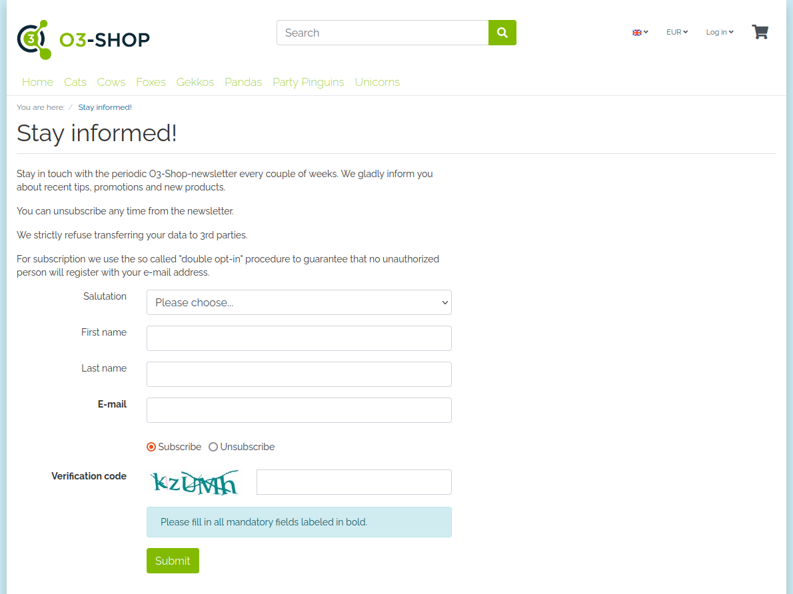

```{toctree}
:maxdepth: 1
:hidden:
Welcome <Welcome>
```
```{toctree}
:maxdepth: 1
:hidden:
:caption: User Manual
Installation <User/Installation/index>
Use <User/Use>
```
```{toctree}
:maxdepth: 1
:hidden:
:caption: Developer Manual
Get involved <Developer/GetInvolved>
```

# O3-Shop Captcha plugin



A CAPTCHA (a acronym for "Completely Automated Public Turing test to tell Computers and Humans Apart") is a type of challenge response test used in computing to determine whether the user is human.

This documentation describes all topics related to the module.

The documentation for the O3 shop can be found at [https://docs.o3-shop.com/](https://docs.o3-shop.com/).

## About

- Join the [Community](https://community.o3-shop.com)
- Website: [https://www.o3-shop.com](https://www.o3-shop.com)
- Issue tracker: [https://issues.o3-shop.com](https://issues.o3-shop.com)
- License: [GNU General Public License 3](https://www.gnu.org/licenses/gpl-3.0.de.html)

Thank you for using O3-Shop!
